# Send Purchase Orders: legacy and web screens

Screen-by-screen comparison of the legacy Sending Wizard (`HFSend.exe`, form `FSendingWizard`; retained source `HomeFrontVB6/HFEst/Source/FPOSendingWizard.frm`) with the web `FSendingWizard` (`Components/Pages/Migrated/FSendingWizard.razor`, route `/po-sending-wizard/{PO|RFQ|NOI}`). Screen check: 2026-09-30, pass 5 (after the column-width, row-pitch and picture-offset fixes of the same day).

Full write-up (callers, selection, Finish, close behaviour, launchers, verification): [`../../../sending-ar-wizard-migration-2026-09-13.md`](../../../sending-ar-wizard-migration-2026-09-13.md). Mapping entry: section `11.2a` in [`../../migration_mapping.json`](../../migration_mapping.json).

## Sources

- **Legacy, `legacy_2025_*.png`**: the owner's 2025 screenshots of `HFSend.exe`, pages 1-7 (Task, Communities, Jobs, Vendors, PO Groups, Purchase Orders, Ready with print).
- **Legacy, 2026.6 spec**: Mel Rayment's screens, kept only as the local file `MobileSource/HomeFront/Docs/Send Purchase Order specs-MelR-260930.pdf`. It is not copied here because it is an external email that contains personal addresses. It shows the same frames; its page 3 is the email-only Ready page (screen 07 below).
- **Legacy, `HFSend.exe`**: `HomeFrontVB6/HFEst/HFSend.exe`, read from a disassembly. Comments in the web source cite its addresses (for example `Form_Load` 0x426740, WizHead icon 0xfa27).
- **Web, `web_*.png`**: the fixtures that `verification/WizardChecks` writes (the real component markup), rendered in Chrome with Playwright at 1280 x 740; `web_13_print_output_documents.png` is the report viewer's own markup, top 160px. The CSS stack is the one `verification/WizardChecks/sending-browser.mjs` uses. No live app and no SQL were used, so the rows are fixture data (`CODE-001`, `Fixture POGroupData row 1`, and so on). The Purchase Orders fixture's third column holds numbers, which sit right as flexAlignGeneral puts them; `web_06b_purchase_orders_numeric.png` has text addresses. The DOM measurements behind the verdicts (column widths, row pitch, offsets, font sizes) were taken in the same run at 1280 and 390 px.

## Owner decisions (binding)

- **D1**: printing goes to the web report viewer (Print / Save as PDF). Email, fax, SMS and accounting transport are out of scope. The Ready page wording is truthful: "Click Finish to mark them sent".
- **D2**: NOI runs as "Send new purchase orders", with a plain note on the last page.
- **D3**: no data change for the Purchasing Tasks sidebar. This has no effect on these screens.
- **D4**: Assign TBD and Sending are one program. The Sending Wizard gains an extra first page, "Assignment", only when it continues an Assign TBD commit. The line "N purchase orders remain unassigned." is kept.
- **Print output (2026-09-30)**: the output is independent documents, one per supplier group, as `SendPOGroup` prints one report per recipient; never one combined report per PO format (screen 13).

Two further owner rules apply to the Ready screens. The wording "You have selected N purchase orders. Click Finish to mark them sent" was set on 2026-09-07. On 2026-09-23 the owner ruled that a wizard's last page has no Next button.

## What matches on every screen

- **Header**: "Send purchase orders to vendors" / "The PO sending wizard will help you deliver your PO's". The icon is the envelope, `images/32/email.ico` (the HFSend.exe WizHead icon), on WizHead's navy square: 46px, BackColor &H800000, with the 32px image inset 7px.
- **Frame icons**: each frame has its legacy picture on the left:

  | Frame | Icon |
  | --- | --- |
  | Task | `PurchaseOrderSend.ico` |
  | Communities | `Areas.ico` |
  | Jobs | `Jobs.ico` |
  | Vendors | `vendor.ico` |
  | PO Groups | `poindex.ico` |
  | Purchase Orders | `PurchaseOrder.ico` |
  | Ready | `Info.ico` |
  | Assignment (D4) | `question.ico`, the vbQuestion icon of the MsgBox it replaces |

  The picture sits where the frm puts it: 8px below the Task caption (Image2(0) Top 270, Label3(3) Top 150), level with the grid top on the selection frames (imgError Top 270 = gData Top 270, 16px below the caption at Top 30), 4px below the Ready text (Image4 Top 270, lblFinish Top 210). The content starts 24px to its right (Image2(0) Left 360 to Label3(3) Left 1200), 20px on Ready (Image4 Left 330 to lblFinish Left 1110).
- **Captions**: 11px (8.25pt MS Sans Serif). The Task caption is regular weight (Label3(3) has no Font block); the Select captions are bold (Weight=700). The Task radios are on an 18px pitch (chkSend Top 450, 720), 7px below the caption box.
- **Selection grids**:
  - "Select All" sits at the top right and is ticked, and every row is ticked.
  - No visible header (the uncaptioned header row is collapsed to 0px), no grid lines (GridLines=0) and no sorting.
  - The columns keep their legacy order. The columns before the last are fitted to the rows (`AutoSize(0, 1)`) and the last takes the rest (ExtendLastCol): code 96.8px on 02-04, 96.8 / 80 / rest on 05, 96.8 / 195.6 / rest on 06 (measured at 1280 and 390 px).
  - 16px rows (RowHeightMin=0 under the 8.25pt form font), scaled with the control zoom.
  - Numeric values are right-aligned per cell (flexAlignGeneral) and the checkbox stays on the left, 3px before its code (flexcpChecked). Cells clip at the column edge with no "..." (Ellipsis=0).
- **Ready sentence**: wraps at 275px (lblFinish Width=4125 twips).
- **Buttons**: Cancel, < Back, Next >, Finish, with access keys c/b/n/f and the legacy enabled states.

## Screens

Verdicts are from the pass-5 screen check. MATCH means no difference remains. ACCEPTED means the only differences are the owner decisions named. No MISMATCH remains.

| # | Legacy | Web | Verdict | Notes |
| --- | --- | --- | --- | --- |
| 01 Task (frame 0) | 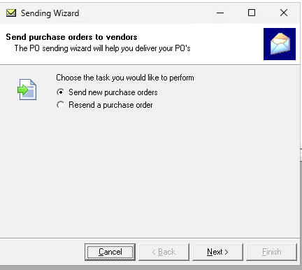 | 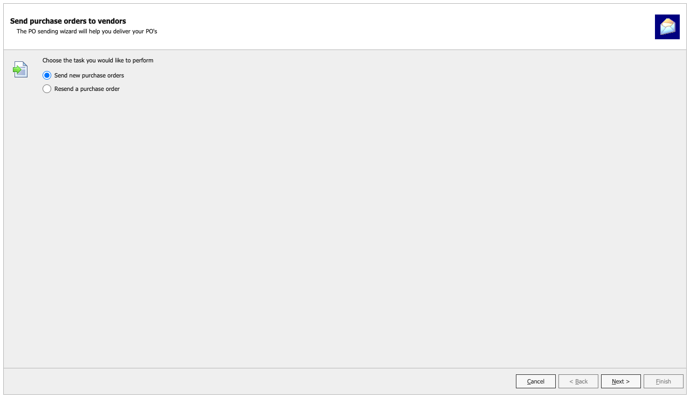 | **MATCH** | "Send new purchase orders" is selected. There is no Select All and no grid. Back and Finish are disabled, as in owner p1 and Mel p1. The picture sits 8px below the caption top and the radios 18px apart, as in the frm. |
| 02 Select Communities (frame 1) | 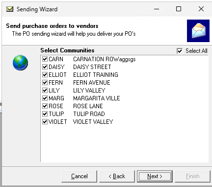 | 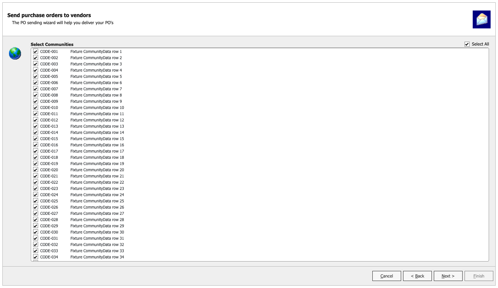 | **MATCH** | The columns are code+checkbox, fitted to 96.8px, then description from the next pixel, as legacy `AutoSize(0,1)` + ExtendLastCol lays them out. 16px rows, no header row, no lines; the picture is level with the grid top. The live grid (TbdAssignmentChecks `?sending=1` at 1600 px) renders the same fit. |
| 03 Select Jobs (frame 2) | 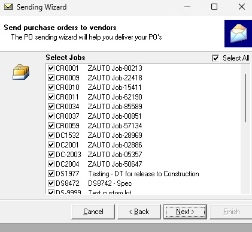 | 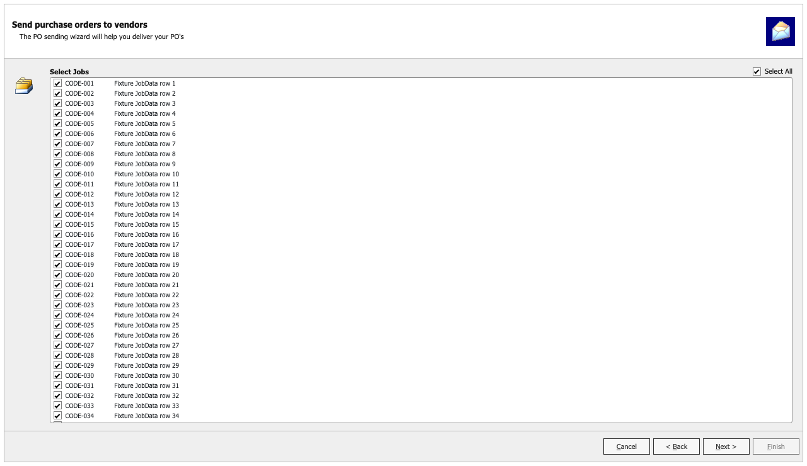 | **MATCH** | The columns are job (96.8px), then description, with the RFQ RFP id hidden as at design time. Owner p3 and Mel p2 show the same narrow job column. |
| 04 Select Vendors (frame 3) | 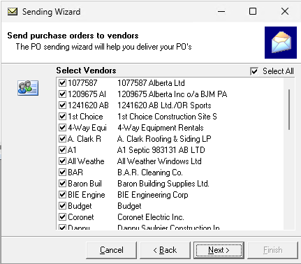 | 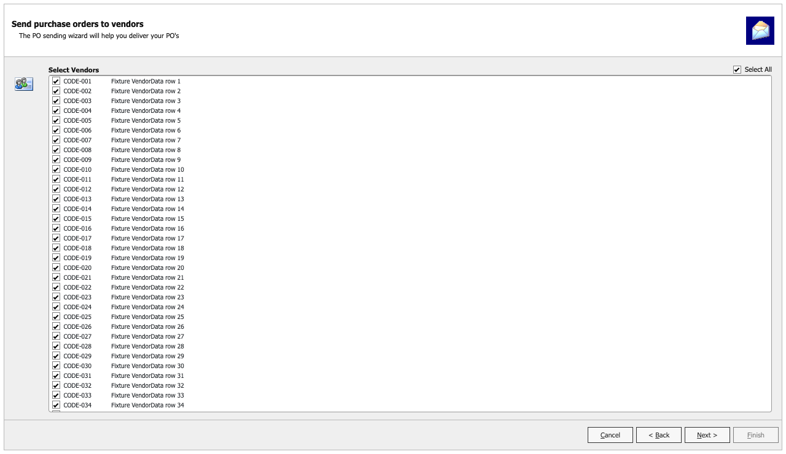 | **MATCH** | The columns are code (96.8px), then name. |
| 05 Select PO Groups (frame 4) | 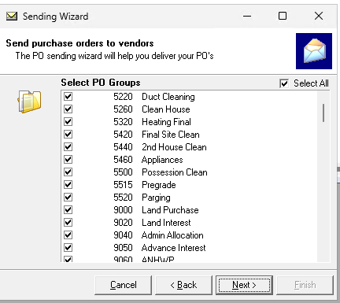 | 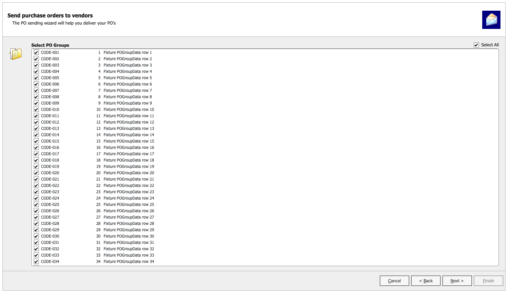 | **MATCH** | The columns are group+checkbox (96.8px), index (80px, right-aligned per cell) and description (the rest), so "Group 2 \| 3140 \| Roofing" is compact, as in Mel p2. A mixed index column keeps its numbers right. |
| 06 Select Purchase Orders (frame 5) | 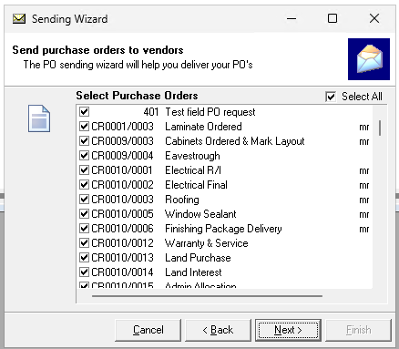 | 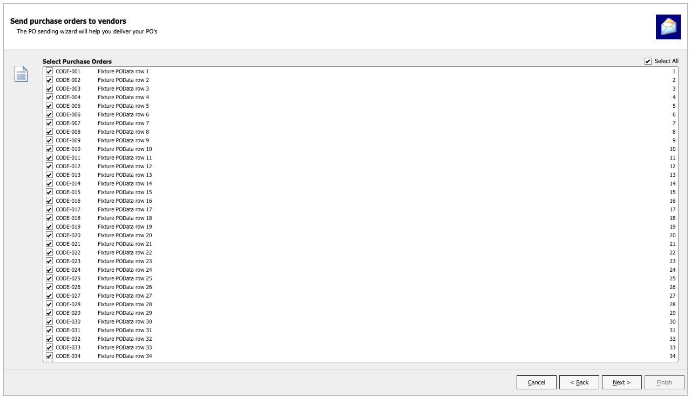 | **MATCH** | The columns are PO number+checkbox (96.8px), description (195.6px) and delivery address (the rest). Numeric PO numbers ('401', '1,250.5', '-7') sit right at the fitted column's edge with the checkbox left, and text numbers next to the checkbox (`web_06b_purchase_orders_numeric.png`); owner p6 has '401' at the edge of the fitted column. In this fixture the third column holds numbers, which sit right; text addresses are left-aligned. |
| 07 Ready, email only (frame 6) | Mel 2026.6 p3 (local PDF, not copied) | 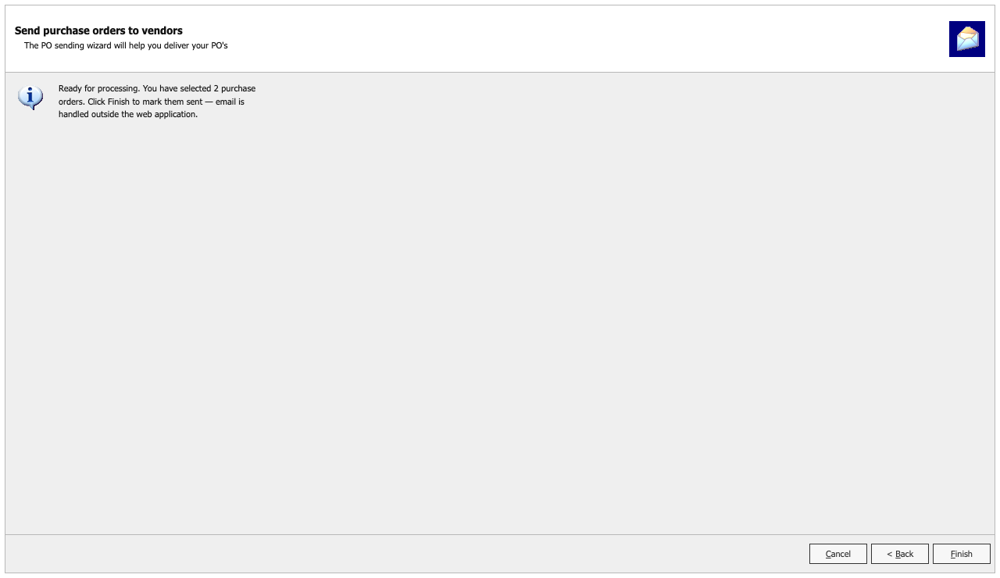 | **ACCEPTED** (D1, truthful wording, no Next) | Info icon, 4px below the text. The sentence wraps inside 275px over 3 lines, as in Mel p3. There is no print part, printer combo or NOI note. The web reads "...You have selected 2 purchase orders. Click Finish to mark them sent — email is handled outside the web application."; the exe reads "2 POs for sending. Click Finish to send these documents now." |
| 08 Ready with print (450 selected, 194 to print) | 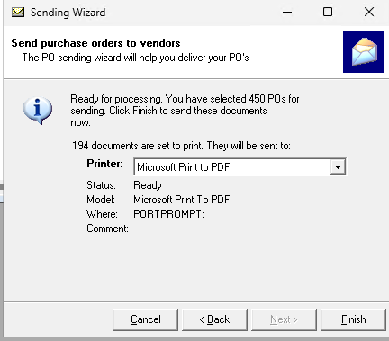 | 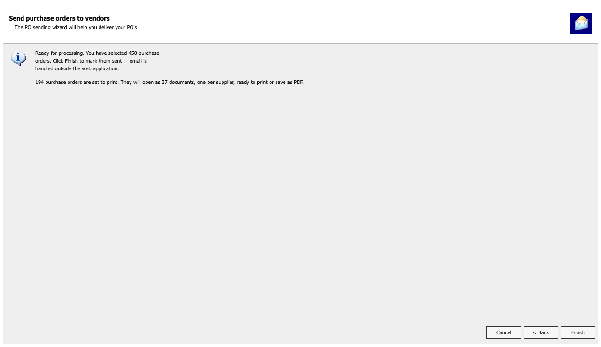 | **ACCEPTED** (D1, truthful wording, no Next) | The print part reads "194 purchase orders are set to print. They will open as 37 documents, one per supplier, ready to print or save as PDF." in place of legacy "194 documents are set to print. They will be sent to:" and its Printer combo with Status/Model/Where/Comment. "one per purchase order" shows when every PO is its own document, and one PO reads "1 purchase order is set to print. It will open as one document, ...". The show rule for this line is still open for the owner (see Owner confirmation). |
| 09 Ready, NOI | none (HFSend has no NOI frame) | 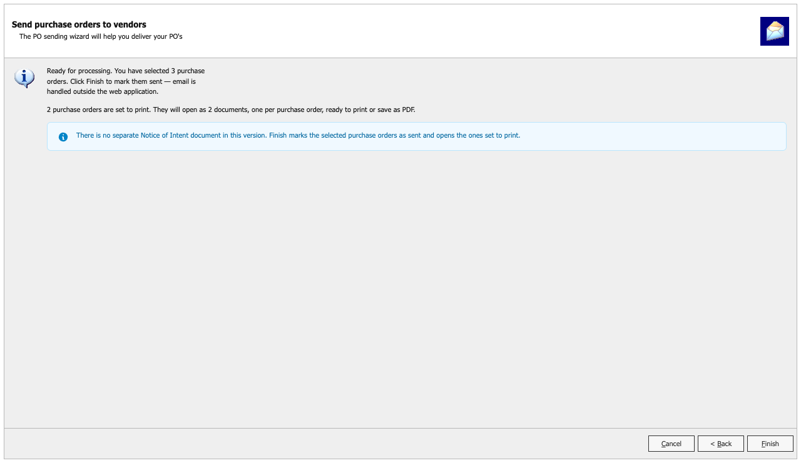 | **ACCEPTED** (D2, D1, truthful wording) | The run uses the PO header, noun and icon. The print line reads "2 purchase orders are set to print. They will open as 2 documents, one per purchase order, ...". The plain note "There is no separate Notice of Intent document in this version. ..." sits above the navigation at the wizard's 11px size. |
| 10 Assignment (Assign TBD continuation) | none (legacy is the MsgBox at `FTBDAssignmentWizard.frm:236-238`) |  | **ACCEPTED** (D4) | The Sending Wizard's own header, the question icon, and the bold heading "Purchase orders assigned" (not VB6 text). The sentence is frm:237 verbatim: "5 purchase orders have been assigned. 2 are approved. Do you want to send them now?". The kept line is "3 purchase orders remain unassigned.". Next stands for OK and Cancel for Cancel; Back and Finish are disabled. Next runs one at a time while the SendPO gate is read. |
| 11 Assignment with refused changes | none | 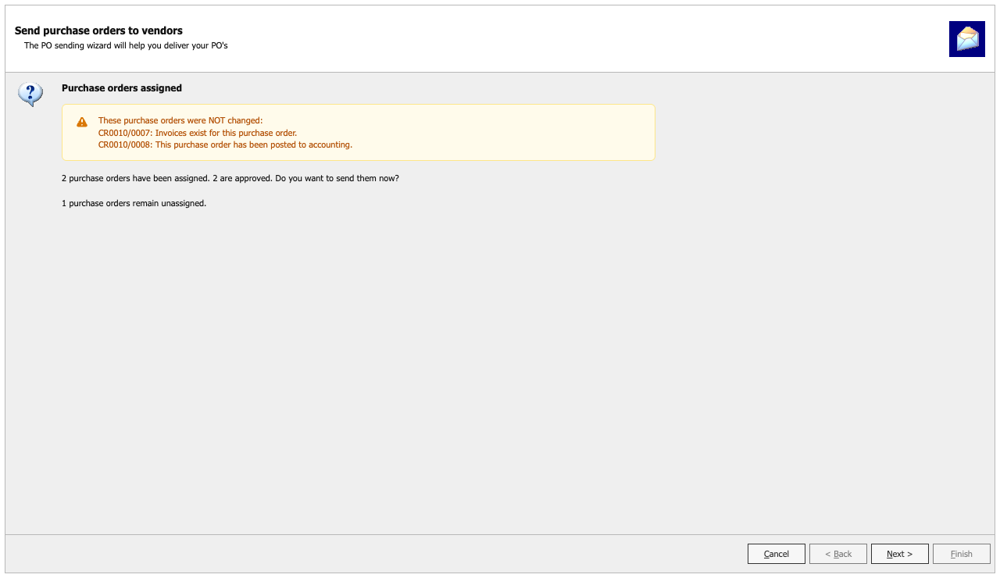 | **ACCEPTED** (D4, truthful reporting) | As 10, plus a FlexKit warning, "These purchase orders were NOT changed:", listing the refused lines. It sits between the heading and the question at the wizard's 11px text size. |
| 12 Assignment hosted in the Assign TBD window | none |  | **ACCEPTED** (D4, one program) | The Assign TBD window holds only the Sending Wizard on its Assignment page, with no TBD grid or steps. The frm:237 sentence keeps its verbatim "1 are approved." |
| 13 Print output after Finish | none on screen: `SendPOGroup` (frm:1607-1815) opens one report per supplier group and prints it (PrintOut) or exports one "Purchase Orders.pdf" per recipient | 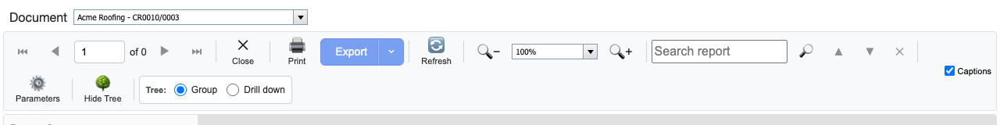 | **ACCEPTED** (D1; owner 2026-09-30) | The report viewer opens one independent document per supplier group (delivery method, delivery address, PO format and vendor, frm:1587) in the SendPOs run order (`ORDER BY DeliveryMethod, DeliveryAddress, VendorDesc`, frm:1577/1579), never one combined report per PO format. The chooser is captioned "Document" and lists "<VendorDesc> - <PO>" or "<VendorDesc> - n purchase orders (a, b, ...)"; the shot shows "Acme Roofing - CR0010/0003". Print and Save as PDF are the viewer's own. The Issue POs and Manual PO previews keep their "PO format" chooser. |

## Open items

None from the screen check. Closed since the first check of 2026-09-30: the column widths on 02-06 (the header row is kept, uncaptioned, and collapsed, so `table-layout: fixed` honours the fitted widths; `ShowHeader="false"` had left the row-window spacer as the first row), the 16px row pitch, the picture offsets and the 24px / 20px content gap, the 11px captions, the NOI note size, per-cell numeric alignment, the 3px checkbox gap and Ellipsis=0 clipping.

## Owner confirmation needed (no code change)

- **Ready print line (screen 08).** The web shows the line when at least one PO will open in the viewer. Legacy shows it when `PrintedPOs <> 0` (frm:1283).
  - For fax-only or blank-address-only selections, the web shows the line and legacy does not.
  - For print POs that have no PO format, legacy counts them and the web does not.
  - The legacy rule would make "They will open ... ready to print or save as PDF." untrue.
- **RFQ Ready.** It says "Printing is handled outside the web application." because RFQ has no print path.
- **PM-email break (screen 13).** With `SendPO_CCPrjMgr` on, legacy also starts a new group when the job PM's email changes (frm:1572-1577, 1587). The web document key is delivery method, address, PO format and vendor only, because transport is out of scope (D1).
