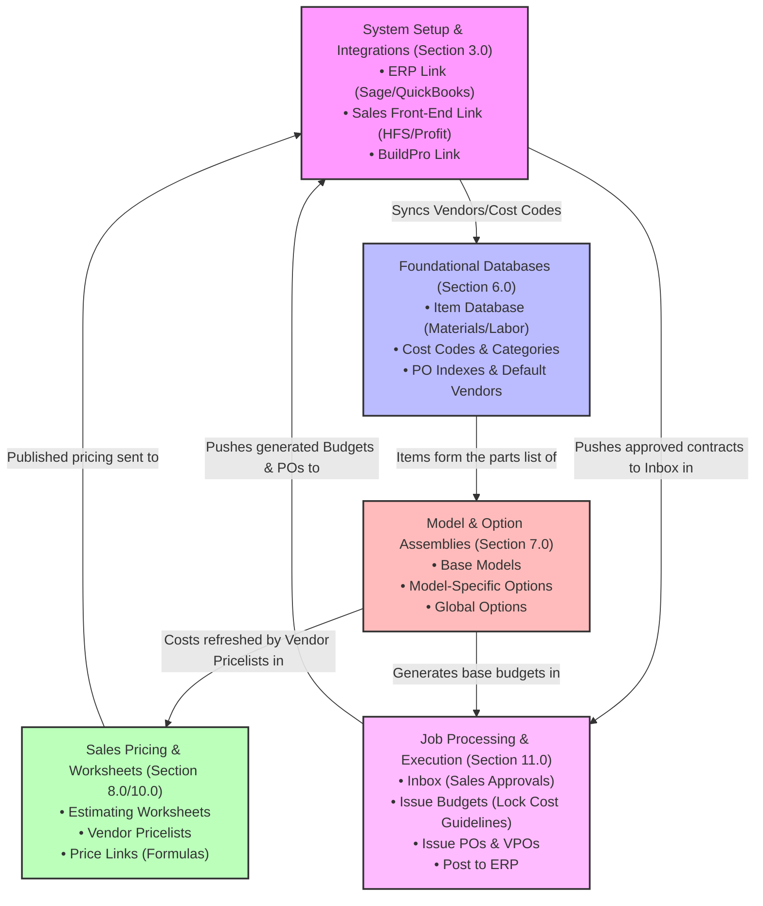

# Precision Builder: System Overview, Context, and Walkthrough Questions

This document provides a high-level conceptual overview of the **Hyphen HomeFront Precision Builder** system, outlines how its core functional modules relate to one another, provides verbatim extracts from the official User Guide for reference, and lists **10 critical questions** to ask the team/person during your upcoming system walkthrough.

---

## 1. Executive Summary & Context

**Precision Builder** is the core estimating, purchasing, and budgeting engine of the Hyphen HomeFront suite. It sits between two major systems:
1. **Sales Front-Ends** (e.g., HomeFront Profit Builder, HomeFront Sales/HFS, or Builder 1440): Where pre-sales, inventory homes, and buyer option selections are captured and approved.
2. **Accounting ERPs** (e.g., Sage 300, Sage Intacct, Sage 100, QuickBooks): Which hold the master vendor records, job cost codes, and accounting ledgers.

Precision Builder's primary job is to take approved sales contracts, translate the sold house model and options into detailed construction estimates (material and labor), generate **Job Budgets** and **Purchase Orders (POs)**, and post them to the ERP for financial tracking, while also sending schedule/PO data to **BuildPro** for field execution.

---

## 2. Main System Areas and Their Relationships

Precision Builder's workflow is divided into five main functional layers:

### How the Main Areas Relate to Each Other:
1. **The Setup Layer (1.0 - 4.0)** establishes the parameters for accounting integration (ERP), sales front-end integration, and BuildPro Mnemonics. It controls which menu options are visible and how databases sync.
2. **The Catalog Database (6.0)** pulls master Vendors and Job Cost Codes from the ERP and links them to items (lumber, concrete, labor hours) in the **Item Database**. Items are assigned to **Purchase Order (PO) Indexes** (trade categories like Plumbing, Framing) so they can be grouped onto POs.
3. **The Product Assembly Library (7.0)** uses items from the Catalog to build **Assemblies** for base **Models** and various **Options** (e.g., a three-car garage option). These assemblies serve as standard recipe templates.
4. **The Worksheets and Vendor Pricing Layer (8.0 - 10.0)** pulls vendor pricelists (often uploaded via Excel) and matches them to items in the assemblies. Estimators use **Estimating Worksheets** to calculate costs, apply margins/markups, and **Publish** option retail prices back to the Sales System.
5. **The Job Processing Layer (11.0)** is the transactional end-point. When a sale occurs, the contract appears in the **Inbox**. Precision Builder retrieves the matching Model and Option Assemblies, applies current vendor prices, and opens the **Issue Budgets** screen to generate a cost guideline (budget) and **Issue POs** to trade partners, posting these financial commitments directly back to the ERP.

---

## 3. Copy-Paste Extracts from the User Guide

The following sections are transcribed verbatim from the *Hyphen HomeFront User Guide V3.1* to provide exact functional context:

### A. Modifying Grids and Line Items (Page 12)
> **2.3 Modifying Grids and Line Items**
> 
> Grids are widely used in Precision Builder. They appear in many interfaces of Precision Builder; examples are listed below:
> * Item Database window
> * Model and Option Library
> * Issue Budget window
> * Issue PO’s window
> * Estimating worksheets
> 
> **Deleting Records and Line Items**
> Highlight the rows that contain the information to be deleted, press the `CTRL+ DELETE` or right click and select remove items.
> 
> **Changing values on line items**
> Highlight the cell of the desired line item.
> or
> Type in the new value on the cell and click Save button to save.
> 
> *Note: This action will not work if the line-item font appears light gray, indicating that they are not editable. This happens after Budgets or POs have been generated in job records.*
> 
> **Assigning the same value to multiple rows**
> If the same value is to be assigned to multiple consecutive rows:
> 1. Highlight the cells to be changed by left clicking and dragging the mouse cursor downwards, starting from the highest cell in the column or using shift + left click to select a section of line items.
> 2. With the cells highlighted, if a pick list is available click the button as shown below or press the space bar to display the pick list. Selecting the desired item from the list will assign the same value to all highlighted cells.
> 3. If no pick list is available; with the cells highlighted, type in the value to insert and press the enter key on the keyboard.
> 4. Click the Save button to save.

### B. Setup and Purchasing Options (Page 28)
> **3.7 Purchasing Options**
> 
> The Purchasing Options menu item has four distinct segments:
> **Budgeting & Purchasing:** Allows the user to control the functionality of the Budgeting and Purchasing processes. The options under Budgeting & Purchasing are discussed below.
> * **Jobs require sales approval before purchasing can begin:** Approval from Sales is needed before Estimating can receive the job file.
> * **Let me use a forecasted cost basis to refresh PO costs:** If this option is checked, then by clicking the refresh costs button on Issue Budgets or Issue PO's window, users will have the ability to specify prices from the list of 12 forecast periods in addition to the Current, and Next Prices.
> * **Combine multiple PO indexes per vendor to a single purchase order:** This applies to users that have the same vendor assigned to multiple PO indexes that are having POs generated in the same release. Check this box to see if all items should be combined in a single purchase order. Leaving the box unchecked will generate individual POs for each PO Index. *This must remain unchecked for BuildPro Integration.*
> * **Let me add and remove contract items (model and option assemblies) on jobs:** This applies to users that either do not use HomeFront's Profit Builder, or those that want to be able to create job budgets or purchase orders without having a corresponding item coming from HomeFront's sales front end Profit Builder or HFS. With this checkbox marked, users will be able to right click and add a new contract item when in the Issue Budgets or Issue PO's screen.
> * **Let purchasers change the sale quantity:** Allows the same option to be selected more than the specified sales quantity when published.
> * **Use components in assembly definitions:** Adds the Components Grid in Edit Models & Options.

### C. Model and Option Assemblies (Page 83)
> **7.0 MODEL AND OPTIONS ASSEMBLIES**
> 
> **7.1 Model and Option Assembly menu navigation and summary**
> 
> The Assembly library is available through the workflow as well as the Task Bar menu... Once selected, the pick list allows the following selection:
> * **Models:** in most cases these are base plans
> * **Model Specific Options:** specific to models only
> * **Design Center Option:** exclusive to the Design center process
> * **Global Options:** applicable to all models within one or many communities
> 
> Model and Option Assemblies are the next most important entities to be created in Precision Builder after the creation of the Item Database. Model and Option Assemblies are estimates of different products, using the items from the Estimating Item Database.

### D. Price Levels & Vendor Price Management (Page 97)
> **8.0 VENDOR PRICE MANAGEMENT**
> 
> **8.1 Price Level and Item Type System Lookups**
> 
> Pricing levels and Item Types enable different pricing based on any of the below combinations. 1-6 is looked up in Vendor Pricing (Vendor Pricelists) whereas 7 is from the Item table (Item Database).
> 
> **Vendor Pricelists**
> 1. Community, Community Phase, Assembly, Item
> 2. Community, Assembly, Item
> 3. Assembly, Item
> 4. Community, Community Phase, Item
> 5. Community, Item
> 6. Item
> 
> **Item Database**
> 7. Item database
> 
> When prices are viewed/changed using Edit Models & Options screen, the price will read/write to either the Vendor Pricing list or the Items list depending upon how the fields below are configured.
> 
> **Descriptions of Price Levels and Item Type is as follows:**
> * **Item Type Column:**
>   * *Quote:* Price is Assembly Specific
>   * *Unit Price:* Price is not Assembly Specific
> * **Price Level Column:**
>   * *Corporate:* Price applies to all Divisions
>   * *Global:* Price applies to all communities in same Division

### E. Processing Job Records (Page 145)
> **11.0 PROCESSING JOB RECORDS**
> 
> This process will begin after a Presale, Inventory Home or Change Order has been created and approved within HFS. The published assemblies/Sales records will have been used to create the Pre-Sale, Inventory Home or Change Order. If the assembly was published with missing items, inaccurate take-offs etc., the Job Record will replicate the same inaccuracies. However, HomeFront allows for changes and updates within the job record.
> 
> **11.1 Job Budgets (Issue Budgets)**
> 
> Job Budgets are created from the Assemblies in Edit Models and Options and in theory should match the original assembly of the model and any options sold for the contract. The job budget creates a cost guideline.
> 
> **The process would be as follows:**
> 1. Accept the Job from the Inbox
> 2. Review and Generate the Job Budget
> 3. Finalize the Budget (creates ability to lock the budget and add variance purchase orders)

---

## 4. 10 Questions to Ask During Your Walkthrough

Ask these targeted, expert-level questions during your walkthrough to clarify implementation details, boundaries, and best practices:

### 1. Database Synchronization & Master Data
> [!NOTE]
> **Context:** Precision Builder synchs accounting data (Vendors, Job Cost Codes, Categories) from the ERP.
* **Question:** *"If a Vendor or Job Cost Code is updated or added in the accounting system, how is the sync triggered? Is it a real-time event hook, or is it a manual process run via the 'Database Synchronization' tool, and how do we ensure estimators do not use stale codes?"*

### 2. BuildPro Integration Constraints (PO Combining)
> [!WARNING]
> **Context:** The guide states that the checkbox *"Combine multiple PO indexes per vendor to a single purchase order"* must remain **unchecked** for BuildPro Integration.
* **Question:** *"Why must this option remain unchecked for BuildPro integration? If we leave it unchecked, how do we prevent trade partners from getting flooded with 15 separate small POs on the same job release?"*

### 3. Grid Settings Overwriting & Permissions
> [!IMPORTANT]
> **Context:** The guide mentions that when a window closes, it saves the current grid layout to the user file, and the last window closed overrides the settings.
* **Question:** *"Since grid layouts (visible columns, sorting, headers) are saved on close and the last window closed wins, is there a way to establish a read-only global default template so estimators don't accidentally overwrite or hide crucial columns for other team members?"*

### 4. Custom Request Flow & Inbox Lifecycle
> [!NOTE]
> **Context:** Custom Requests are sent from HFS/Profit Builder to Precision's Inbox for Estimating to apply takeoff quantities and pricing.
* **Question:** *"What is the exact lifecycle of a Custom Request? Once Estimating applies takeoff quantities and prices and approves the request, how does it sync back to HFS, and does it require re-approval from the Sales department before returning to the Inbox?"*

### 5. Overlapping Model & Option Assemblies (Takeoffs)
> [!NOTE]
> **Context:** Base Models and Options are separate assemblies. When sold together, they are combined to form the contract budget.
* **Question:** *"If an option sold changes the quantities of items in the base Model assembly (e.g., upgrading from standard carpet to hardwood throughout the living room), how does the system deduct the base item quantity while adding the option item quantity? Do we use negative takeoffs in the Option assembly, or does Option Intersection handle this?"*

### 6. Price Lookup Failures & Fallback Heuristics
> [!WARNING]
> **Context:** Section 8.1 lists 7 lookups for pricing. If the default vendor doesn't have a price list entry, there is a setting to *"Use Maximum price if no vendor price found"*.
* **Question:** *"If a vendor price lookup fails and 'Use Maximum price if no vendor price found' is unchecked, does the system fall back to the Item Database standard price (lookup #7) or flag an error? How does this impact the 'Issue Budget' screen when generating POs?"*

### 7. Cost Refresh and Budget Lock Interaction
> [!CAUTION]
> **Context:** Refreshing costs updates assemblies when vendor prices change, but line items become light gray and uneditable after budgets or POs are generated.
* **Question:** *"Once a Job Budget is generated and locked, what happens if a vendor issues a price increase? Can we run 'Refresh Costs' on locked budgets, or does it require creating a Variance Purchase Order (VPO) to represent the price difference?"*

### 8. Room Setup and Automated Takeoffs
> [!NOTE]
> **Context:** Section 9.4 covers Room Setup and Model Dimensions, where dimensions are configured to compute takeoffs.
* **Question:** *"How are Room Dimensions and Category Setup integrated with the Item Database? Can the system dynamically multiply room square footage or perimeter values by an item's quantity factor to automate takeoff calculations when compiling assemblies?"*

### 9. Variance Purchase Orders (VPO) & ERP Coding
> [!IMPORTANT]
> **Context:** VPOs are created in the job record and need separate Cost Categories with the "IsVariance" box checked.
* **Question:** *"How are Variance Purchase Orders (VPOs) routed and coded when posting back to Sage/Intacct? Do they post to a different ledger code, and how does the system track who authorized the variance?"*

### 10. Sage Intacct Change Order Routing
> [!NOTE]
> **Context:** Section 11.3 covers Sage Intacct and Sage 300 Change Order integration.
* **Question:** *"When a Change Order is approved in Profit/HFS and processed in Precision Builder, does it update the existing PO on the ERP side, or does it issue a separate 'Change Order PO' with an alpha suffix (e.g., PO-1234-A) to keep the original PO clean?"*
